# Лабораторная работа 2

### Задание 1

Были выбраны ключевые слова в языках программирования:
C++: int, return, if, while, class  
Java: int, return, if, while, class  
Python: def, class, if, for, return  

Ключевые слова имеют специальное значение в синтаксисе языка, поэтому использовать их в качестве обычных имён переменных нельзя.

Например, в C++ запись

int return = 5;  
будет ошибочной, поскольку return является ключевым словом.
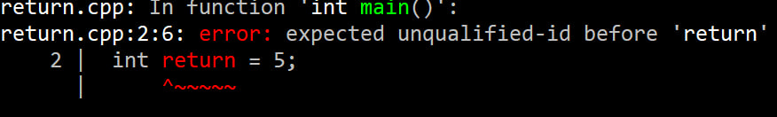

В Python аналогично:

for = 10  
вызовет синтаксическую ошибку.  
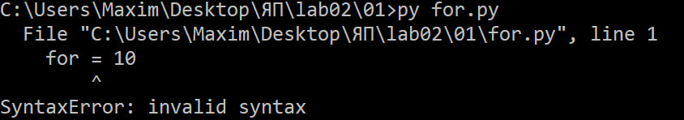

### Задание 2

Программа на C++
int main() {  
    int a = 1, b = 2;  
    int c = a++b;  
    return 0;  
}  
При трансляции программа выдаёт синтаксическую ошибку:
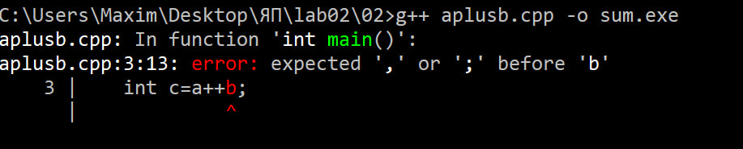
 
Проблема заключается в том, что после разбора a++ остаётся идентификатор b, между которыми нет оператора.

Последовательность токенов можно представить так:

int | c | = | a | ++ | b | ;  

Здесь:  
int — ключевое слово;  
c, a, b — идентификаторы;  
= — оператор присваивания;  
++ — оператор постфиксного увеличения;  
; — разделитель.  

После a++ компилятор получает выражение, а затем сразу b. В C++ такая конструкция не предусмотрена синтаксисом языка и будет выдавать ошибку.

Программа на Python

a = 1  
b = 2  
c = a++b  
В Python эта запись не вызывает синтаксическую ошибку именно на этапе разбора.
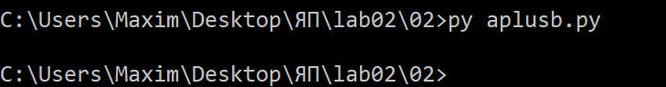
Последовательность токенов:

a | = | 1
b | = | 2
c | = | a | + | + | b
В Python два знака + разбираются как два отдельных оператора:

a + (+b)
То есть первый + является оператором сложения, а второй — унарным оператором +.

Поэтому выражение считывается как  
c = a + (+b)  
При a = 1 и b = 2 получаем c = 3

Таким образом, различие связано именно с разбиением исходного выражения на токены. В C++ ++ является отдельным токеном и воспринимается как оператор инкремента, а в Python два + могут быть двумя отдельными операторами.

### Задание 3

Исходная программа:

int main() {
    int a = 1, b = 2;
    int c = a+++b;
    return 0;
}

Эта программа корректна и выполняется без ошибки.
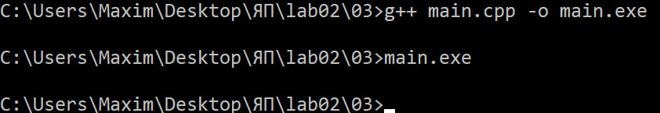

Последовательность токенов:

| int | main | ( | ) | { |   
| int | a | = | 1 | , | b | = | 2 | ; |  
| int | c | = | a | ++ | + | b | ; |  
| return | 0 | ; |  
}  

Главная интересующая нас часть:

| a | ++ | + | b |

Она означает:

(a++) + b

Сначала используется текущее значение a, после чего a увеличивается на единицу.

До выполнения:
a = 1
b = 2

Вычисление:

c = (a++) + b;

Поэтому после выполнения:

a = 2
b = 2
c = 3

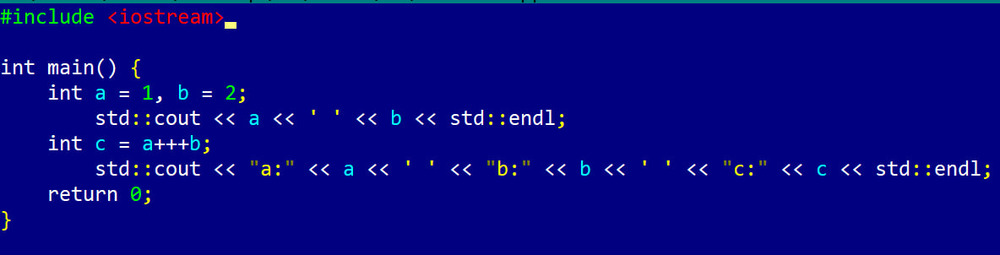
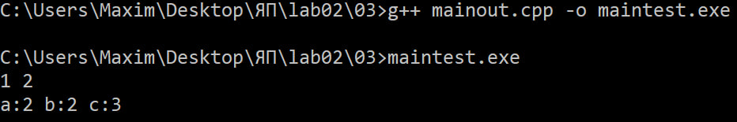

Это выражение можно было записать как:  
int c = a+ + +b;  
Результат работы:  
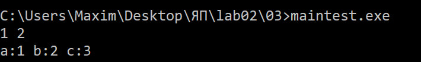

inc c = c++ +b;  
Результат работы:  

int c = c+ ++b;  
Результат работы:  
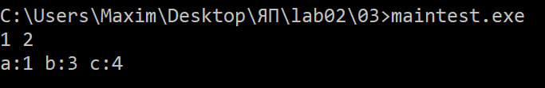 

### Задание 4

Круглые и квадратные скобки могут использоваться в разных синтаксических конструкциях.

##### Круглые скобки
Круглые скобки используются, например, при вызове функции:

cout << sqrt(25);  
Здесь sqrt(25) означает вызов функции sqrt.

Также круглые скобки могут использоваться просто для изменения порядка вычислений:  

a = (b + c) * d;  
В этом случае скобки не являются отдельным оператором, а задают порядок операций.

Ещё один пример

if (a > b) {  
	cout << a;  
}  
Здесь скобки используются для записи условия оператора if.

##### Квадратные скобки

Квадратные скобки используются для обращения к элементу массива:  

int a[5];  
a[2] = 10;  
В выражении a[2] они используются для обращения к элементу массива.

При объявлении самого массива int a[5]
квадратные скобки уже являются частью синтаксиса объявления массива и значение в них задаёт размер массива.

### Задание 5

Исходный код:

print(*map(sum, zip(  
    *[map(int, input().split()) for i in (1, 2, 3)]  
)))  
В программе используются ключевые слова Python: for, in.  
Идентификаторами являются: print, map, sum, zip, int, input, i.  
i — переменная, используемая в цикле.

Остальные идентификаторы являются именами встроенных функций:  
print — вывод данных;  
map — применение функции к элементам последовательности;  
sum — вычисление суммы;  
zip — объединение элементов нескольких последовательностей;  
int — преобразование значения в целое число;  
input — ввод строки.  

split является именем метода строкового объекта.

В программе есть литералы: 1, 2, 3;  
Они образуют кортеж: (1, 2, 3)

В программе используется распаковка элементов последовательности.  
print(*[1, 2, 3])  
передаёт в print три отдельных аргумента.

##### Вызываемые функции и их параметры
Сначала вызывается:  
input()  
Она считывает строку.

Затем:  
.split()  
разделяет введённую строку на отдельные элементы.

После этого:  
map(int, ...)  
преобразует каждый полученный элемент в целое число.

Конструкция:  
[map(int, input().split()) for i in (1, 2, 3)]  
выполняется три раза, то есть считывает три строки.

Затем:  
zip(*[...])  
Суммирует/объединяет соответствующие элементы трёх полученных последовательностей.

После этого:  
map(sum, ...)  
вычисляет сумму каждого полученного столбца.

В конце:  
print(*...)  
выводит полученные суммы.

##### Что делает программа
Программа считывает три строки целых чисел, например:  
1 2 3  
4 5 6  
7 8 9  

После этого она рассматривает их как таблицу:  
1 2 3  
4 5 6  
7 8 9  

и складывает числа по столбцам:  
1 + 4 + 7 = 12  
2 + 5 + 8 = 15  
3 + 6 + 9 = 18  

Результат:  
12 15 18  
Таким образом, программа читает три строки чисел, складывает полученные столбцы с помощью zip, а затем вычисляет сумму каждого столбца.

### Задание 6

В C++ используются два основных вида комментариев:  
1) Однострочный комментарий - начинается с // и заканчивается в конце строки. 

2) Многострочный комментарий начинается с /* и заканчивается */.

При этом многострочные комментарии в C++ не могут быть вложенными.

##### Пример 1

cout<<"Hello /* Это комментарий */ world";
Синтаксически корректен.

/* и */ находятся внутри строки и поэтому "/* Это комментарий */" будет считаться часть строки, а не комментарием.

На экран будет выведено:  
Hello /* Это комментарий */ world  
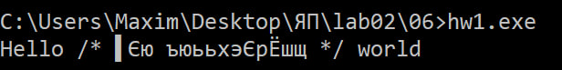  
(У меня полетела кодировка, но суть осталась та же)

##### Пример 2

// /*    
 Это комментарий
*/  

Синтаксически неверен.  
Первая строка полностью является однострочным комментарием:  
// /*  
После перевода строки комментарий заканчивается.

Следующая строка:  
Это комментарий  
уже рассматривается как код, а следующая:  
*/  
содержит закрытие комментария без соответствующего открытия.

Поэтому программа содержит ошибку и не скомпилируется.
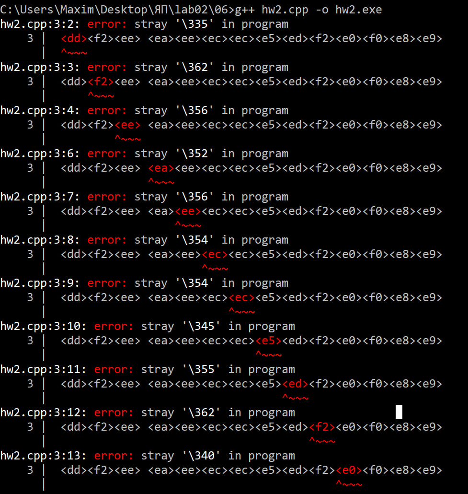

##### Пример 3
/* Я комментирую программы /* комментарий */ */  
Синтаксически неверен.

Первое:  
/*  
открывает комментарий.

Первое встретившееся:  
*/  
его закрывает.

А последняя */ пытается закрыть несуществующий комментарий.

##### Пример 4

// Я комментирую программы /* комментарий */  
Синтаксически корректен.  
Всё после // до конца строки является комментарием. Поэтому /* и */ внутри этой строки никакого значения не имеют.
##### Пример 5

/* Я комментирую свои программы  
// Это комментарий до конца строки */  
*/  
Синтаксически неверен.

После /* начинается многострочный комментарий. Всё внутри него, включая //, рассматривается как часть этого комментария.  
Поэтому:  
// Это комментарий до конца строки */  
не является отдельным однострочным комментарием.  
Встреченный */ закрывает первоначальный многострочный комментарий.  

Последующий  */ остаётся лишним и вызывает ошибку.

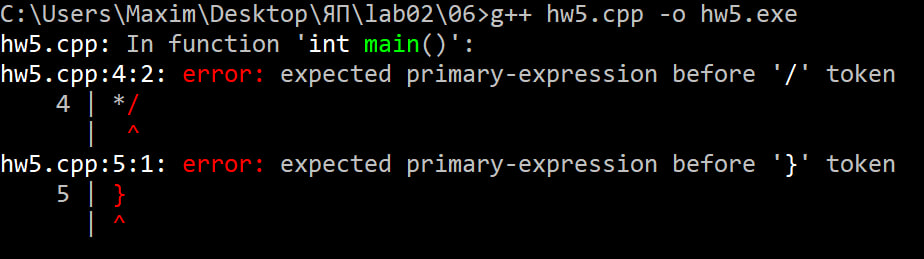

### Задание 7

В стандарте C++17 N4659 в приложении A.5 приведено правило iteration-statement. В нём указано 4 вида циклов: while, do-while, обычный for и range-based for (цикл for по диапазону).
Само правило имеет вид:  

iteration-statement:  
    while ( condition ) statement  
    do statement while ( expression ) ;  
    for ( init-statement conditionopt ; expressionopt ) statement  
    for ( for-range-declaration : for-range-initializer ) statement  
Здесь conditionopt и expressionopt означают необязательные элементы. Это соответствует грамматике N4659.

##### 1. Цикл while
Правило:  
while ( condition ) statement

Формат записи:  
while (условие) инструкция  
Сначала проверяется условиеи если оно истинно, то выполняется инструкция. После этого условие проверяется снова.

Пример:  
int x = 1;

while (x < 1000) {  
    cout << x;  
    x *= 2;  
}  

Здесь:  
while — ключевое слово  
(x < 1000) — условие.  
блок { ... } — инструкция, выполняемая в цикле.  

##### 2. Цикл do-while
Правило:

do statement while ( expression ) ;  

Формат:  

do  
    инструкция  
while (условие);  

В отличие от while, сначала выполняется инструкция, а уже потом проверяется условие. Поэтому тело do-while выполнится как минимум один раз, то есть проверка проводится уже после выполнения инструкции.

Пример:  
int x = 1;

do {  
    cout << x;  
    x++;  
} while (x < 5);  

##### 3. Обычный цикл for

Правило:  
for ( init-statement conditionopt ; expressionopt ) statement  

Формат записи:  

for (инициализация; условие; изменение)  
    инструкция  
	
Здесь:  
init-statement — начальная настройка цикла  
condition — условие продолжения  
expression — выражение, выполняемое после каждой итерации  

Пример:  
for (int i = 0; i < 10; i++) {  
    cout << i;  
}  

Здесь int i = 0 инициализация, i < 10 условие, i++ изменение переменной после каждой итерации.

Условие и последнее выражение в грамматике могут отсутствовать, например:  
for (;;) {  
    cout << "Hello";  
}  
Это бесконечный цикл.

##### 4. Цикл for по диапазону
Правило:  
for ( for-range-declaration : for-range-initializer ) statement  

Формат:  
for (переменная : последовательность)  
    инструкция  
	
В этом варианте переменная последовательно принимает значения элементов диапазона.

Пример:  
int a[] = {10, 20, 30};  
  
for (int x : a) {  
    cout << x;  
}  

Здесь int x переменная цикла, a диапазон, по которому выполняется перебор.

В стандарте этот вариант называется range-based for statement.

### Задание 8

Программа:  
int main() {  
    int a, x, y, z;  
    cin >> x >> y >> z;  
    a = -x + y * (z - 1);  
}  
Нужно построить абстрактное синтаксическое дерево для выражения, вычисляющего a:  
a = -x + y * (z - 1);

Сначала определяется структура выражения.
Самая внешняя операция это присваивание:  

=  

Слева находится переменная a, справа:  

-x + y * (z - 1)  
У операции + два операнда:  
-x и y * (z - 1)

При этом умножение выполняется раньше сложения.

Выражение (z - 1) также является отдельной частью дерева.

Получаем следующее абстрактное синтаксическое дерево:

                 =
               /   \
              a     +
                   / \
                  -   *
                  |  / \
                  x y   -
                       / \
                      z   1

То есть сначала вычисляется:  
z - 1  

затем:  
y * (z - 1)  

отдельно вычисляется:  
-x  

после чего результаты складываются:  
-x + y * (z - 1)  
и полученное значение присваивается переменной a.