# Языки программирования

## Лабораторная работа 3

### Задание 1 **(3)**

*Составьте глоссарий из определений лекции. Проверка отчета будет включать
проверку знания определений*

**Тип в программировании** — атрибут объекта данных, задающий множество допустимых значений и методы для работы с ними.

**Статическая типизация** — свойство языка программирования, при котором тип объекта данных определяется в момент трансляции программы. Тип переменной определяется, например, её объявлением, а тип результата выражения — оператором и типами операндов.

**Динамическая типизация** — свойство языка программирования, при котором тип объекта данных определяется на этапе выполнения программы в момент создания или присваивания значения.

**Неявная типизация** — способ определения типа, при котором тип определяется автоматически по тексту программы на этапе трансляции, без непосредственного указания типа программистом.

**Явное преобразование типа** — преобразование, которое явно указано в программе в виде вызова функции или специальной операции.

**Неявное преобразование типа** — преобразование, которое не указано в программе непосредственно, но транслятор самостоятельно подставляет необходимый способ преобразования.

**Сильная типизация** — характеристика языка программирования, в котором отсутствует или имеется очень небольшое количество правил неявного преобразования типов.

**Слабая типизация** — характеристика языка программирования, в котором имеется большое число правил неявного преобразования типов и допускаются каламбуры типизации.

Следует отметить, что сильная и слабая типизация являются не двумя строго разделёнными категориями, а качественной характеристикой системы типов языка: типизация одного языка может быть сильнее или слабее типизации другого.

### Задание 2 **(3)**

*Запишите правила неявного преобразования типов в языке С++*

*Проверка отчета будет включать проверку знания правил.*

**1. Преобразования при присваивании**

При присваивании значение правого операнда неявно приводится к типу левого операнда.

```cpp
int x;
double d = 3.14;

x = d;
```

В данном случае значение d преобразуется из double в int, поэтому дробная часть отбрасывается и в x будет записано 3.

При передаче аргумента функции фактический параметр также приводится к типу формального параметра.

```cpp
void f(int x) {}

f(3.14);
```

Перед вызовом функции значение 3.14 преобразуется в int.

**2. Преобразования при арифметических действиях**

Перед выполнением арифметической операции типы операндов согласуются по следующим правилам:

* если длина обоих типов меньше int, они преобразуются к int;
* если типы имеют разную длину, меньший тип преобразуется к большему;
* если типы имеют одинаковую длину, но один знаковый, а другой беззнаковый, знаковый преобразуется к беззнаковому;
* если один операнд целочисленный, а другой вещественный, целочисленный операнд преобразуется к вещественному.

Например:

```cpp
short a = 10;
short b = 20;
auto c = a + b;
```

Операнды a и b преобразуются к int, поэтому результат a + b имеет тип int.

**3. Преобразования с логическими значениями**

При преобразовании в bool нулевое значение превращается в false, а любое ненулевое значение — в true.

```cpp
bool a = 0;   // false
bool b = 5;   // true
```

При преобразовании из bool значение false превращается в 0, а true — в 1.

```cpp
int x = false; // 0
int y = true;  // 1
```

В условиях, циклах и логических операциях значения также неявно приводятся к логическому типу.

### Задание 3 **(2)**

*Языки C++ и Java имеют похожий синтаксис, однако
язык С++ относят к языкам со слабой статической типизацией, а Java - с сильной статической типизацией.
Приведите примеры, показывающие это различие. Для этого вам надо подобрать несколько близких по смыслу фрагментов программ,
которые будут транслироваться в С++, но вызывать ошибку согласования типов в Java.*

*Записанные программы сохраните в папке с номером задания. В отчет запишите пояснения к работе программ.*


Различие можно показать на примерах, где C++ автоматически выполняет преобразование типов, а Java требует явного преобразования или вообще запрещает такое преобразование.

**Пример 1. Преобразование double в int.**

C++:

```cpp
#include <iostream>
using namespace std;

int main() {
    double x = 3.14;
    int y = x;

    cout << y << endl;
    return 0;
}
```

Программа на C++ будет успешно скомпилирована. Значение 3.14 преобразуется в int, дробная часть отбрасывается, поэтому y будет равен 3.  
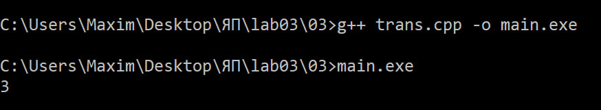 
Java:

```java
public class D2Int {
    public static void main(String[] args) {
        double x = 3.14;
        int y = x;
    }
}
```

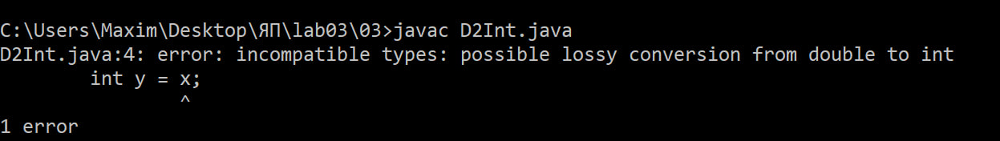

В Java возникнет ошибка согласования типов: преобразование double в int требует явного указания преобразования:

```java
int y = (int)x;
```

**Пример 2. Преобразование int в char.**

C++:

```cpp
#include <iostream>
using namespace std;

int main() {
    int x = 65;
    char c = x;

    cout << c << endl;
    return 0;
}
```

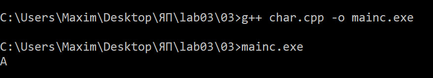 	

C++ выполняет неявное преобразование int в char.

Java:

```java
public class I2Char {
    public static void main(String[] args) {
        int x = 65;
        char c = x;
    }
}
```

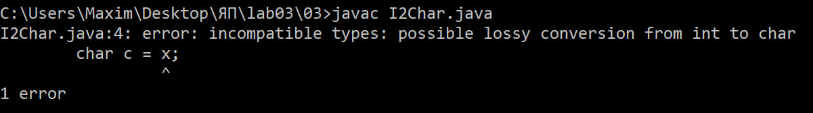

Такое присваивание в Java вызывает ошибку, требуется явное преобразование:

```java
char c = (char)x;
```

**Пример 3. Преобразование числа в логическое значение.**

C++:

```java
#include <iostream>
using namespace std;

int main() {
    int x = 10;
    bool b = x;

    cout << b << ' ' << typeid(b).name() << endl;
    return 0;
}
    }
}
```

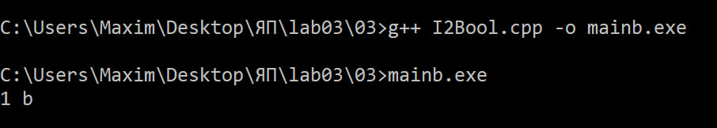

В C++ ненулевое целое число автоматически преобразуется в true.

Java:

```java
public class I2Bool {
    public static void main(String[] args) {
        int x = 10;
        boolean b = x;
    }
}
```

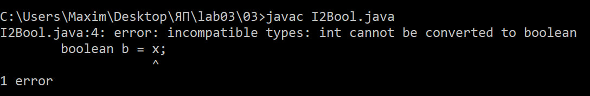

В Java преобразование целого числа в boolean не допускается, поэтому программа не будет скомпилирована.

Таким образом, в C++ большое количество неявных преобразований позволяет использовать значение одного базового типа там, где требуется другой тип. В Java система типов строже и многие такие преобразования требуют явного указания либо запрещены.

### Задание 4 **(1)**

*Рассмотрите следующий фрагмент программы.*

```cpp
bool x = true, y = false;
auto a = x & y;
std::cout << typeid(a).name() << std::endl;
auto b = x && y;
std::cout << typeid(b).name() << std::endl;
```

*Используя* **typeid**, *найдите типы переменных* **a** и **b**. *Объясните результат.*

*Записанную программу сохраните в папке с номером задания.*


Переменная a имеет тип int, а переменная b имеет тип bool.

При выполнении:

```cpp
auto a = x & y;
```

используется побитовая операция &. Перед выполнением битовой операции операнды должны быть целыми. Значения bool проходят целочисленное продвижение и преобразуются в int:

```
true - 1
false - 0
```

Поэтому выполняется:

```cpp
1 & 0
```

Результат равен 0 и имеет тип int. Следовательно, auto выводит для a тип int.

Во втором случае:

```cpp
auto b = x && y;
```

используется логическая операция &&. Ее операнды приводятся к логическому типу, а результат самой логической операции имеет тип bool. Поэтому b имеет тип bool.

Значение, возвращаемое typeid(a).name(), зависит от компилятора и реализации C++. Вывод через G++:

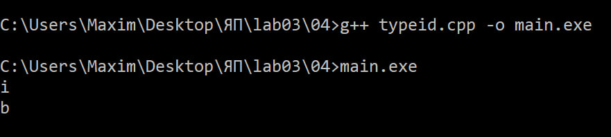

где i обозначает int, а b - bool. 

### Задание 5. **(2)**

*Приведите разумные (логичные) примеры использования в
С++ ключевых слов* **typedef, auto, decltype, static_cast** и оператора **sizeof**.

*Записанные программы сохраните в папке с номером задания. В отчет запишите пояснения к программам*


**1. typedef**

typedef удобно использовать для создания короткого имени сложного или часто используемого типа.

```cpp
#include <iostream>
using namespace std;

typedef unsigned long long ull;

int main() {
    ull number = 5000000000ULL;

    cout << number << endl;
    return 0;
}
```

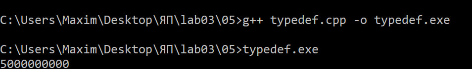

Здесь для типа unsigned long long создаётся короткое имя ull, что делает запись программы компактнее.

**2. auto**

auto удобно использовать, когда тип переменной очевиден из выражения, которым она инициализируется.

```cpp
#include <iostream>
using namespace std;

int main() {
    auto x = 25;
    auto y = 3.14;

    cout << x << " " << y << endl;
    return 0;
}
```

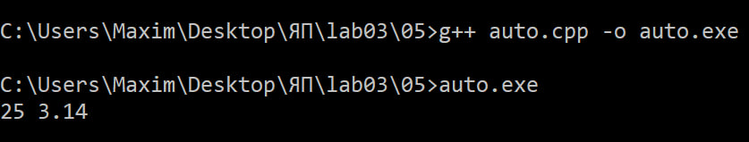

В данном случае компилятор автоматически определяет тип "x" как int, а "y" как double.

**3. decltype**

decltype позволяет получить тип существующего выражения. Это удобно, когда тип заранее неизвестен или имеет сложную запись.

```cpp
#include <iostream>
using namespace std;

int main() {
    int a = 10;

    decltype(a) b = 20.0;

    cout << b << endl;
    return 0;
}
```

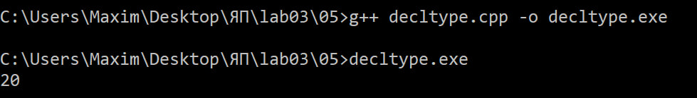

decltype(a) определяет тип выражения a, поэтому b также получает тип int.

**4. static_cast**

static_cast используется для явного преобразования одного типа в другой.

```cpp
#include <iostream>
using namespace std;

int main() {
    double x = 5.75;
    int y = static_cast<int>(x);

    cout << y << endl;
    return 0;
}
```

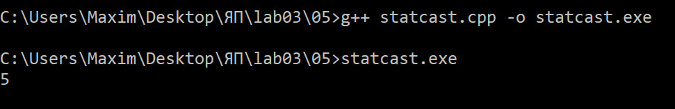

Здесь double явно преобразуется в int. В результате дробная часть отбрасывается, и y получает значение 5.  
static_cast применяется для явного преобразования типа на этапе трансляции.  
**5. sizeof**

Оператор sizeof позволяет узнать размер объекта или типа в байтах.

```cpp
#include <iostream>
using namespace std;

int main() {
    int x = 10;

    cout << sizeof(x) << endl;
    cout << sizeof(int) << endl;

    return 0;
}
```

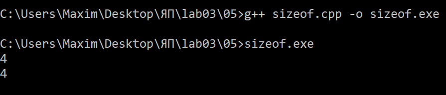

Оба выражения показывают размер типа int в байтах на конкретной платформе. Это может использоваться, например, для оценки объёма памяти, занимаемого данными.

### Задание 6 **(2)**

Рассмотрите следующий фрагмент программы.

```cpp
int a = -1, b = 1;
unsigned int c = 1;
std::cout << a*b << std::endl;
std::cout << a*c << std::endl;
```

* *Объясните работу этой программы, используя правила неявного преобразования типов*
* *Что произойдет, если тип* **int** *заменить на* **short**, а* **unsigned int** *на* **unsigned short**?*


В первом выражении:

```
a * b
```

обе переменные имеют тип int, поэтому дополнительного преобразования между ними не требуется.

Получаем:

```
-1 * 1 = -1
```

На экран выводится:

```
-1
```

Во втором выражении:

```cpp
a * c
```

a имеет тип int, а c — unsigned int.

Типы имеют одинаковую длину, но один является знаковым, а другой беззнаковым. Согласно правилам неявного преобразования из лекции, знаковый тип в этом случае преобразуется к беззнаковому, поэтому -1 преобразуется в unsigned int.

Для 32-разрядного unsigned int число -1 после преобразования получает значение:

```
4294967295
```

После этого выполняется:

```
4294967295 * 1 = 4294967295
```

Поэтому результатом второго выражения будет большое беззнаковое число.

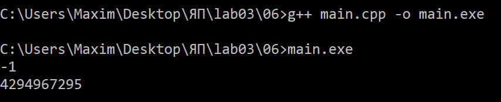

Если заменить типы следующим образом:

```cpp
short a = -1, b = 1;
unsigned short c = 1;
```

то ситуация изменится. Согласно правилам неявного преобразования, если длина обоих типов меньше int, то они сначала преобразуются к int.

Таким образом:
short в int
unsigned short в int


И выражение:

```cpp
a * c
```

фактически становится:

```
(-1) * 1
```

Поэтому результатом будет:

```
-1
```

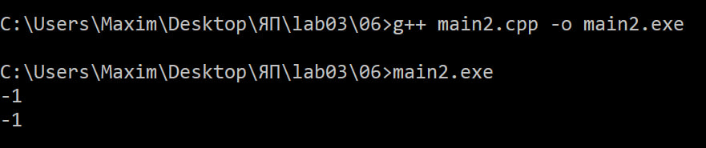

Таким образом, переход от int/unsigned int к short/unsigned short меняет результат из-за целочисленного продвижения к int.

### Задание 7 **(2)**

Рассмотрите следующий фрагмент программы.

```cpp
int x = 7, y = 4;
long double d = 0.25;
cout << (x / y) / d << endl;
cout << (x / d) / y << endl;
long a = 200000, b = 200000;
long long c = 200000;
std::cout << (a * b) * c << std::endl;
std::cout << a * (b * c) << std::endl;
```
(Пропущены std::)

*Почему изменения порядка действий приводит
к изменению результата? Объясните работу этой программы, используя правила
неявного преобразования типов*


В первых двух выражениях изменение порядка действий влияет на тип промежуточного результата.

Первое выражение:

```cpp
(x / y) / d
```

Сначала вычисляется:

```cpp
x / y
```

Обе переменные имеют тип int, поэтому выполняется целочисленное деление:

```
7 / 4 = 1
```

Только после этого результат 1 преобразуется в long double при делении на d:

```
1 / 0.25 = 4
```

Следовательно, результат:

```
4
```

Во втором выражении:

```cpp
(x / d) / y
```

сначала вычисляется:

```cpp
7 / 0.25
```

Так как один операнд имеет тип int, а другой — long double, целое значение преобразуется в long double:

```
7 в 7.0
```

Получаем:

```
7 / 0.25 = 28
```

Затем:

```
28 / 4 = 7
```

Следовательно, результат второго выражения:

```
7
```

Разница появляется потому, что в первом варианте целочисленное деление выполняется **до** преобразования к вещественному типу.


Рассмотрим следующие выражения:

```cpp
(a * b) * c
a * (b * c)
```

Переменные имеют типы:

```cpp
long a = 200000;
long b = 200000;
long long c = 200000;
```

В первом варианте сначала вычисляется:

```cpp
a * b
```

Оба операнда имеют тип long, поэтому на этом этапе они не преобразуются в long long.

Значение математически равно:

```
200000 * 200000 = 40000000000
```

Если на используемой платформе long имеет 32-битный размер, это значение не помещается в long. Происходит переполнение ещё до умножения на c.

Во втором варианте сначала вычисляется:

```cpp
b * c
```

Типы long и long long имеют разную длину, поэтому b преобразуется к long long.

Тогда вычисление выполняется в long long:

```
200000 * 200000 = 40000000000
```

После этого результат умножается на a, которое также преобразуется к long long.

Математический результат:

```
200000 * 200000 * 200000 = 8000000000000000
```

Таким образом, изменение порядка действий может привести к разному результату, поскольку преобразование типов выполняется на каждом отдельном этапе вычисления.

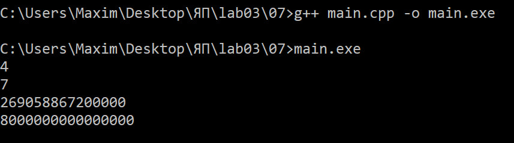

### Задание 8 **(2)**

*Для каких значений целочисленных переменных* **x**, **y** ,**z** *результатом
вычисления следующего выражения будет истина? Перечислите* **все** *случаи.
Объясните работу этой программы, используя правила неявного преобразования типов*

```cpp
(x == y) + (x == z) == true
```

*Записанные программы сохраните в папке с номером задания.*

Каждое выражение сравнения:

```cpp
x == y
x == z
```

возвращает значение типа bool.

В C++:

```
false - 0
true - 1
```

Поэтому сумма:

```cpp
(x == y) + (x == z)
```

может иметь только три значения:

```
0
1
2
```

Правая часть сравнения:

```cpp
== true
```

фактически сравнивает сумму с 1.

Следовательно, всё выражение истинно тогда и только тогда, когда сумма равна 1.

Это происходит только в двух случаях:

**1. x == y, но x != z:**

Например:

```
x = 5, y = 5, z = 10
```

Тогда:

```
(x == y) = true  = 1
(x == z) = false = 0
1 + 0 = 1
1 == true - true
```

**2. x != y, но x == z:**

Например:

```
x = 5, y = 10, z = 5
```

Тогда:

```
(x == y) = false = 0
(x == z) = true  = 1
0 + 1 = 1
1 == true - true
```

Все случаи:

```
(x = y и x != z)
или
(x != y и x = z)
```

То есть x должен быть равен только одному из двух значений y и z. При y = z выражение истинным быть не может. Правила преобразования bool в 0/1 и арифметического сложения логических значений следуют из системы неявных преобразований C++.

### Задание 9 **(2)**

*Проверьте работу логического выражения*

```cpp
x==y==z
```

*в языках* **Python**, **Java**, **C++** *для
целочисленных переменных* **x**, **y**, **z**.
*Объясните результат для каждого из языков.*


Выражение x == y == z по-разному интерпретируется в Python, Java и C++.

**Python**

В Python это цепочечное сравнение:

```python
x == y == z
```

означает:

```python
(x == y) and (y == z)
```

Поэтому выражение истинно только тогда, когда:

```
x = y = z
```

Пример:

```python
x = 5
y = 5
z = 5

print(x == y == z)
```

Результат - True

Если:

```python
x = 5
y = 5
z = 10
```

результат будет - False

**Java**

В Java оператор == не является цепочным сравнением. Выражение:

```java
x == y == z
```

с целочисленными x, y, z вообще не будет корректно компилироваться.

Сначала вычисляется:

```java
x == y
```

Получается значение типа boolean. Затем программа фактически пытается выполнить сравнение:

```java
boolean == int
```

Такое сравнение в Java недопустимо, поэтому возникает ошибка согласования типов.

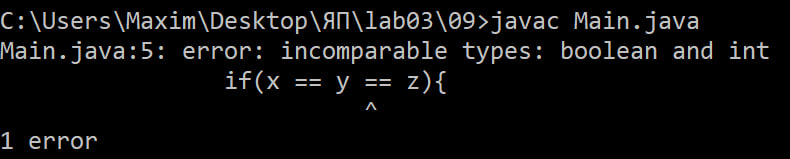  
**C++**

В C++ выражение разбирается слева направо:

```cpp
x == y == z
```

Сначала вычисляется:

```cpp
x == y
```

Результат имеет тип bool.

Затем этот bool участвует во втором сравнении:

```cpp
(x == y) == z
```

При сравнении bool с целым числом логическое значение неявно преобразуется в int:

```
false - 0
true  - 1
```

Поэтому фактически происходит одно из двух сравнений:

```
0 == z
```

или

```
1 == z
```

Результат работы при x = 1, y = 2, z = 3:

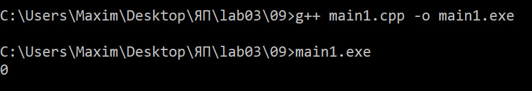

Например, при x = 5, y = 5, z = 1 получаем:

```
x == y - true - 1
1 == z -  1 == 1 - true
```

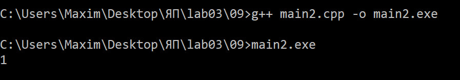

Поэтому выражение даёт true, хотя x, y и z не равны между собой.

Таким образом, результаты различаются:

* Python рассматривает x == y == z как цепочку сравнений;
* Java не позволяет выполнить такое сравнение для трёх int;
* C++ вычисляет сравнение слева направо и использует неявное преобразование bool в целое число.


### Задание 10 **(1))**

*Напишите программу на* **Python** *, демонстрирующую возможность неявного преобразования
строки в логическое значение.*

*Записанную прамму сохраните в папке с номером задания.*


В Python строка может неявно преобразовываться в логическое значение при использовании её в условии.

```python
text = input("Введите строку: ")

if text:
    print("Строка преобразована в True")
else:
    print("Строка преобразована в False")
```

Если пользователь введёт непустую строку, она будет неявно преобразована в True.

Например:

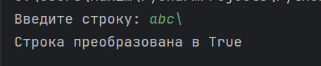

Если строка будет пустой:

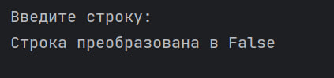

В Python пустые объекты и нулевые значения при преобразовании к bool дают False, а непустые и ненулевые значения - True.
