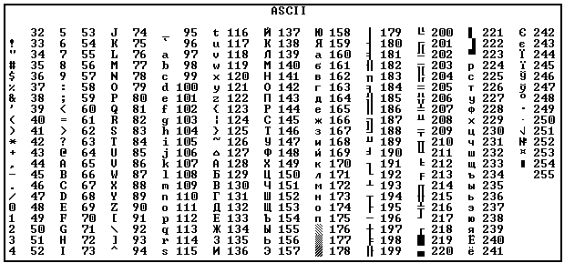
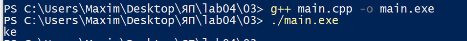
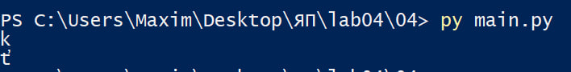
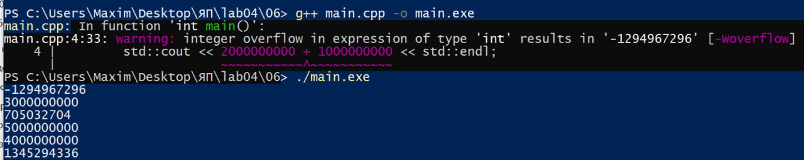
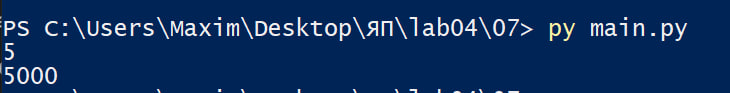
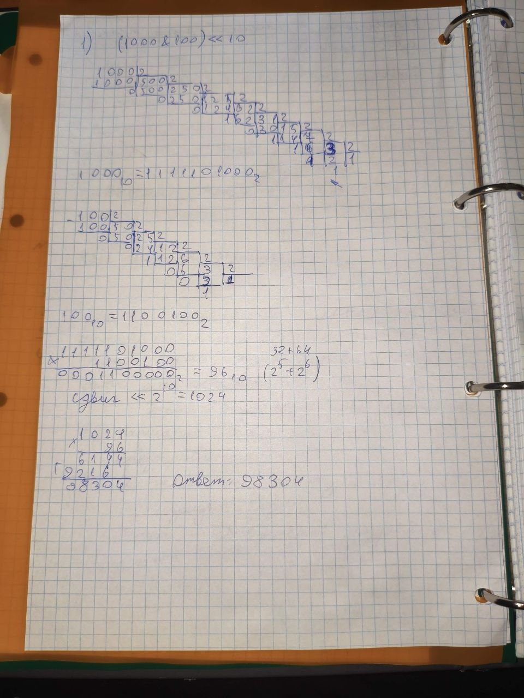
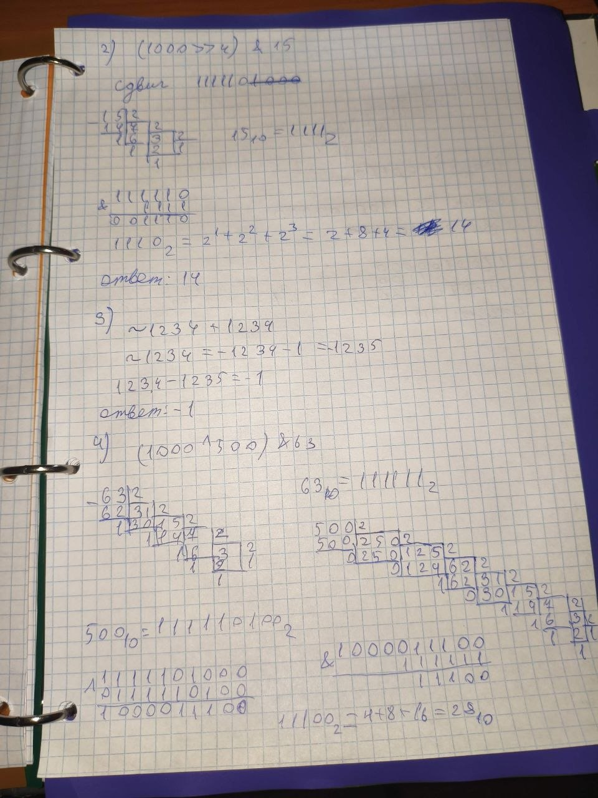
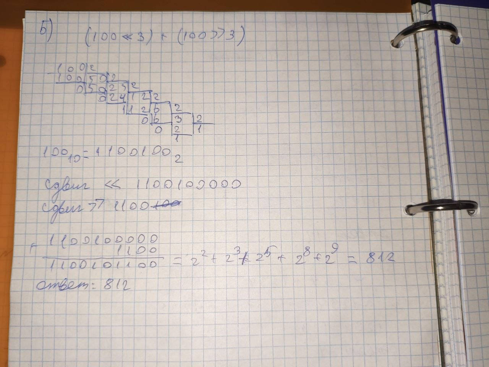
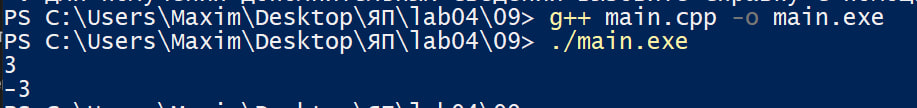
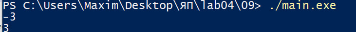

# Языки программирования
## Лабораторная работа 3

### Задание 1 **(3)**
* *Запишите двоичное представление числа -99 в целочисленном знаковом типе длиной 1, 2, 4 байта.* 
* *Запишите литералы равные наибольшему и наименьшему числу в типе* **int** *в шестнадцатеричной записи.*
* *Запишите двоичное представление символа "`#`" в типе* **char**.

**Ответ:**

-99 в 1 байте 10011101  
-99 в 2 байтах 11111111 10011101  
-99 в 4 байтах 11111111 11111111 11111111 10011101  
Максимальный int 0x7FFFFFFF  
Минимальный int -0x7FFFFFFF - 1  
`#` имеет код 35, поэтому в двоичном виде 00100011

### Задание 2 **(3)**
*Напишите пример программы на С++ с использованием целочисленных литералов в разных форматах записи, 
разной длины, знаковых и беззнаковых. 
Пример должен охватывать большинство способов записи целочисленных литералов.*

**Ответ:**

```cpp
int a = 123;              // десятичная запись
int b = 0123;             // восьмеричная
int c = 0b101101;         // двоичная
int d = 0xFF;              // шестнадцатеричная
signed int e = -50;       // знаковое
unsigned int f = 3000000000U; // беззнаковое
long g = 100000L;         // long
long long h = 9000000000LL; // long long
unsigned long long i = 500ULL; // unsigned long long
short j = 1234;           // short
```

### Задание 3 **(2)**
*Объясните работу фрагмента программы на С++. В ходе объяснения следует использовать таблицу кодов символов.*
```cpp
char a = 'a';
a = a + 10;
std::cout << a;
a = a + 250;
std::cout << a;
```

**Ответ:**



'a' имеет код 97, после a + 10 получаем 107, то есть 'k'.

Дальше: 107 + 250 = 357, Вв1 байте берется остаток по модулю 256,
357 - 256 = 101, код 101 — это 'e'.

Вывод программы: 'ke'


### Задание 4 **(2)**

*Перепишите программу из предыдущего задания на Python, используя функции* **chr** и **ord**.
*Почему ее вывод отличается от вывода программы на С++?*

**Ответ:**

```python
x = 'a'
x = chr(ord(x) + 10)
print(x)
x = chr(ord(x) + 250)
print(x)
```

Вывод



В C++ `char` имеет ограниченную длину, поэтому происходит переполнение по модулю 256, а в Python строка работает с Unicode и такого переполнения нет.

### Задание 5. **(2)**

*Объясните работу фрагмента программы на С++. В частности, почему* $x+x-x=x$, *но при этом*
$(x\cdot 2)/2\neq x$? *В отчете надо привести вычисления, приводящие к ответу.*
```cpp
unsigned short x = 40000;
unsigned short y = x + x;
unsigned short z = x * 2;
y = y - x;
z = z / 2;
std::cout << y << " " << z << std::endl;
```

**Ответ:**

unsigned short занимает 2 байта (16 бит, 2^16), поэтому максимум равен 65535.

x + x = 40000 + 40000 = 80000  
x * 2 = 40000 * 40000 = 80000  
После переполнения:
80000 - 65536 = 14464  

Для y  
14464 - 40000 = -25536,  
-25536 + 65536 = 40000

Для z  
z = 14464, затем 14464 / 2 = 7232  

Поэтому вывод
```text
40000 7232
```

### Задание 6 **(2)**

*Объясните работу фрагмента программы на С++. Если имеет место переполнение, 
то требуется найти точный ответ до запуска программы, а только потом сверить его с выводом.
В отчете надо привести вычисления, приводящие к ответу.*
```cpp
std::cout << 2000000000 + 1000000000 << std::endl;
std::cout << 2000000000U + 1000000000U << std::endl;
std::cout << 2500000000U + 2500000000U << std::endl;
std::cout << 2500000000LL + 2500000000LL << std::endl;
std::cout << 20000U * 200000U << std::endl;
std::cout << 200000U * 200000U << std::endl;
```

**Ответ:**

Для 32-битных чисел предел 2^32 = 4294967296.  
Для 64-битных (long long) -2^63 до 2^63 (signed long long) и 2^64 (unsigned long long).

1. 2000000000 + 1000000000 = 3000000000, переполнение знакового int,
3000000000 - 4294967296 = -1294967296.
2. 2000000000U + 1000000000U = 3000000000.
3. 2500000000U + 2500000000U = 500000000,
5000000000 - 4294967296 = 705032704 (переполнение безнакового int)
4. 2500000000LL + 2500000000LL = 5000000000
5. 20000U * 200000U = 4000000000
6. 200000U * 200000U = 40000000000,
40000000000 - 9 * 4294967296 = 1345294336

Вывод



### Задание 7 **(2)**

*Напишите программу на Python умножающую введенное число на 1000. В программе 
можно использовать только операторы сдвига и сложения. Циклы использовать нельзя. Из функций
можно использовать только* **input** *и* **print** *для ввода и вывода.*
```python
x = int(input())
y = ...
print(y)
```

**Ответ:**

1000 = 512 + 256 + 128 + 64 + 32 + 8, поэтому с помощью побитового сдвига умножим число на 8, 32, 64, 128, 256 и 512, после чего сложим результаты в одно число:

```python
x = int(input())
y = (x << 9) + (x << 8) + (x << 7) + (x << 6) + (x << 5) + (x << 3)
print(y)
```



### Задание 8 **(2)**

*Найдите результаты вычисления следующих выражений без использования компьютера
или калькулятора. Процесс вычислений должен быть отображен в отчете.*
* `(1000 & 100) << 10`
* `(1000 >> 4) & 15`
* `~1234 + 1234`
* `(1000 ^ 500) & 63`
* `(100 << 3) + (100 >> 3)`

**Ответ:**





1. (1000 & 100) << 10 = 96 << 10 = 98304
2. (1000 >> 4) & 15 = 62 & 15 = 14
3. ~1234 + 1234 = -1235 + 1234 = -1
4. (1000 ^ 500) & 63 = 540 & 63 = 28
5. (100 << 3) + (100 >> 3) = 800 + 12 = 812


###  Задание 9 **(2)**
*Напишите программу на языке С++ для умножения заданного целого числа на* -1. *В программе можно использовать только сложение и битовые
операции. Условия, циклы, библиотечные функции использовать нельзя.*

**Ответ:**

```cpp
#include <iostream>

int main() {
	int x;
	std::cin >> x;
	int y = (~x) + 1;
	std::cout << y;
}
```




Это работает по правилу дополнительного кода -x = ~x + 1.
